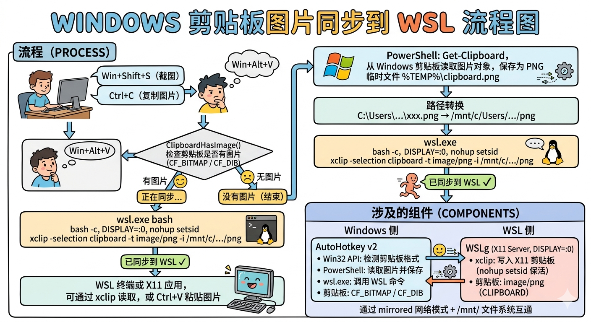
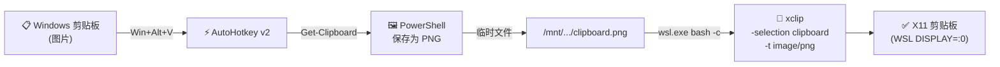

# wsl-image-clipboard-bridge

[English](README.md)

通过 AutoHotkey v2 + xclip 将 Windows 剪贴板中的图片同步到 WSL。

WSLg 仅支持 Windows 与 WSL 之间的**文本**剪贴板同步，不支持图片。本工具通过一个快捷键，将 Windows 剪贴板中的图片桥接到 WSL 的 X11 剪贴板（`xclip`）。

## 工作原理





1. **AutoHotkey v2** 在 Windows 端监听快捷键
2. **PowerShell** 从 Windows 剪贴板读取图片，保存为 PNG 临时文件
3. **wsl.exe** 调用 `xclip` 将 PNG 加载到 WSL 的 X11 剪贴板（`DISPLAY=:0`）

## 环境要求


### Windows

- [AutoHotkey v2](https://www.autohotkey.com/)

### WSL

```bash
sudo apt install -y xclip
```

- 需要启用 WSLg（Windows 11 默认已启用）

## 安装

1. 克隆本仓库或下载 `ClipboardToWSL.ahk`
2. 双击 `ClipboardToWSL.ahk` 运行
3. （可选）将快捷方式放入 `shell:startup` 实现开机自启

## 使用

| 快捷键 | 功能 |
|--------|------|
| `Win+Alt+V` | 将 Windows 剪贴板图片同步到 WSL |

同步时会短暂显示 ToolTip 提示状态。

### 在 WSL 中验证

```bash
# 查看剪贴板格式
xclip -selection clipboard -t TARGETS -o
# 应包含: image/png

# 将剪贴板图片保存为文件
xclip -selection clipboard -t image/png -o > output.png
```

## 为什么需要这个工具？

WSLg 的剪贴板桥接（`wslg-clipboard`）仅处理 `text/plain` 和 `UTF8_STRING` 格式，不转发 `image/png` 等二进制 MIME 类型。本工具利用 PowerShell 作为中间人，填补了这一空缺。

## 许可证

[MIT](LICENSE)
