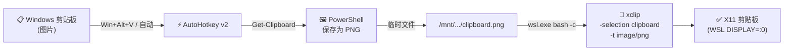

# wsl-image-clipboard-bridge

[English](README.md)

通过 AutoHotkey v2 + xclip 将 Windows 剪贴板中的图片同步到 WSL。

WSLg 仅支持 Windows 与 WSL 之间的**文本**剪贴板同步，不支持图片。本工具将 Windows 剪贴板中的图片桥接到 WSL 的 X11 剪贴板（`xclip`）。

## 两个版本

| 脚本 | 触发方式 | 适用场景 |
|------|---------|---------|
| **`ClipboardToWSL.ahk`** | 仅 `Win+Alt+V` 快捷键 | 手动控制，后台无额外开销 |
| **`ClipboardToWSL_Auto.ahk`** | 剪贴板变化时自动检测 + `Win+Alt+V` 备选 | 无感体验，零额外操作 |

> **手动版：** 按 `Win+Alt+V` 同步，不主动触发则不做任何事。
>
> **自动版：** 通过 `OnClipboardChange` 事件驱动监听（CPU 开销接近零），检测到图片时自动同步。例如 `Win+Shift+S` 截图后立即生效。内置同步锁，防止重复触发。

## 工作原理




1. **AutoHotkey v2** 在 Windows 端监听快捷键（或剪贴板变化事件）
2. **PowerShell** 从 Windows 剪贴板读取图片，保存为 PNG 临时文件
3. **wsl.exe** 调用 `xclip` 将 PNG 加载到 WSL 的 X11 剪贴板（`DISPLAY=:0`）

## 环境要求


### Windows

- [AutoHotkey v2](https://www.autohotkey.com/)

### WSL

```bash
sudo apt install -y xclip
```

- 需要启用 WSLg（Windows 11 默认已启用）

> **提示：** 无需手动启动 WSL 或 WSLg。如果 WSL 未运行，首次触发时会自动启动（冷启动约 1-2 秒延迟）。WSLg 随 WSL 一起启动，`xclip` 会在 WSL 就绪后立即可用。

## 安装

1. 克隆本仓库或下载你需要的 `.ahk` 脚本
2. 双击脚本运行
3. （可选）将快捷方式放入 `shell:startup` 实现开机自启

## 在 WSL 中验证

```bash
# 查看剪贴板格式
xclip -selection clipboard -t TARGETS -o
# 应包含: image/png

# 将剪贴板图片保存为文件
xclip -selection clipboard -t image/png -o > output.png
```

## 为什么需要这个工具？

WSLg 的剪贴板桥接（`wslg-clipboard`）仅处理 `text/plain` 和 `UTF8_STRING` 格式，不转发 `image/png` 等二进制 MIME 类型。本工具利用 PowerShell 作为中间人，填补了这一空缺。

## 许可证

[MIT](LICENSE)
